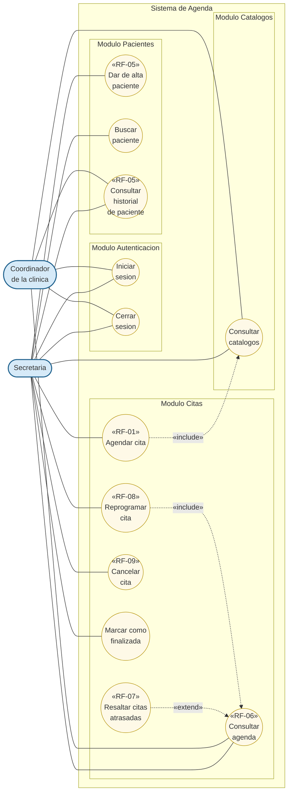

# Diagrama General de Casos de Uso

Vision completa del modulo: actores, modulos y casos de uso de alto nivel. Para el detalle de cada modulo ver los diagramas especificos:

- [Modulo Autenticacion](./01_modulo_autenticacion.md)
- [Modulo Pacientes](./02_modulo_pacientes.md)
- [Modulo Citas](./03_modulo_citas.md)
- [Modulo Catalogos](./04_modulo_catalogos.md)

## Actores

| Actor | Descripcion |
|---|---|
| **Secretaria** | Personal administrativo. Unico actor con capacidad de escritura: registra, reprograma, cancela y consulta citas y pacientes. |
| **Coordinador de la clinica** | Supervisa la operacion. Consulta agenda y catalogos con fines de control y seguimiento. |

> El paciente y el terapeuta **no son actores del sistema** — el modulo es de uso exclusivamente administrativo.

## Diagrama (Mermaid)

## Resumen de casos de uso por modulo

### Modulo Autenticacion
- **Iniciar sesion** — Acceder al sistema con credenciales validas.
- **Cerrar sesion** — Terminar la sesion activa.

### Modulo Pacientes
- **Dar de alta paciente** — Crear el expediente y asignar un identificador unico.
- **Buscar paciente** — Localizar pacientes por nombre o folio.
- **Consultar historial de paciente** — Ver las citas asociadas al expediente.

### Modulo Citas
- **Agendar cita** — Registrar una cita (evaluacion inicial o sesion terapeutica).
- **Consultar agenda** — Visualizar las citas en formato calendario o listado.
- **Reprogramar cita** — Cambiar fecha u hora preservando trazabilidad.
- **Cancelar cita** — Marcar como cancelada y liberar recursos.
- **Marcar como finalizada** — Cerrar la cita una vez atendida.
- **Resaltar citas atrasadas** *(extension visual)* — Alerta cuando la hora actual supero el inicio de una cita programada.

### Modulo Catalogos
- **Consultar catalogos** — Obtener terapeutas, salas, tipos de sesion y estados disponibles para los demas modulos.

## Reglas transversales

1. **Trazabilidad:** ninguna cita se elimina; los cambios siempre quedan reflejados como nuevos estados.
2. **Horario laboral fijo:** lunes a viernes, 09:00 a 17:30.
3. **Validacion centralizada:** toda operacion de escritura sobre citas pasa por la cadena de validacion del backend.
4. **Acceso administrativo:** solo personal administrativo interactua con el sistema.
