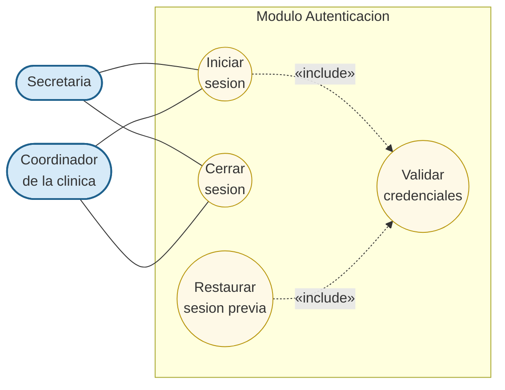

# Modulo Autenticacion - Casos de Uso

Casos de uso relacionados con el control de acceso al sistema. Es transversal: todo modulo de escritura requiere una sesion activa.

## Actores

| Actor | Descripcion |
|---|---|
| **Secretaria** | Inicia y cierra sesion. |
| **Coordinador de la clinica** | Inicia y cierra sesion (acceso de solo consulta a otros modulos). |

## Casos de uso

- **Iniciar sesion** — La secretaria o el coordinador ingresan email y contraseña. El sistema valida credenciales y abre la sesion.
- **Cerrar sesion** — Termina explicitamente la sesion activa.
- **Validar credenciales** *(invocado por iniciar sesion)* — Comprueba que el usuario existe y la contraseña coincide con el hash almacenado.
- **Restaurar sesion previa** *(invocado en la carga inicial)* — Si existe una sesion guardada localmente, la rehidrata sin pedir credenciales otra vez.

## Diagrama (Mermaid)

## Reglas

1. Solo usuarios registrados pueden acceder al sistema.
2. Las contraseñas se almacenan con hash BCrypt; nunca en texto plano.
3. La sesion se mantiene mientras el navegador no la elimine.
4. Si la sesion expira o se invalida, cualquier llamada al backend devuelve un error de autenticacion y el frontend redirige al inicio de sesion.

## Trazabilidad

| Caso de uso | Origen / requisito | Endpoint backend |
|---|---|---|
| Iniciar sesion | (transversal) | `POST /api/auth/login` |
| Cerrar sesion | (transversal) | (limpieza local + sin endpoint) |
| Validar credenciales | (subproceso) | `AuthService.authenticate` |
| Restaurar sesion previa | (mejora UX) | `AuthService.getById` |
