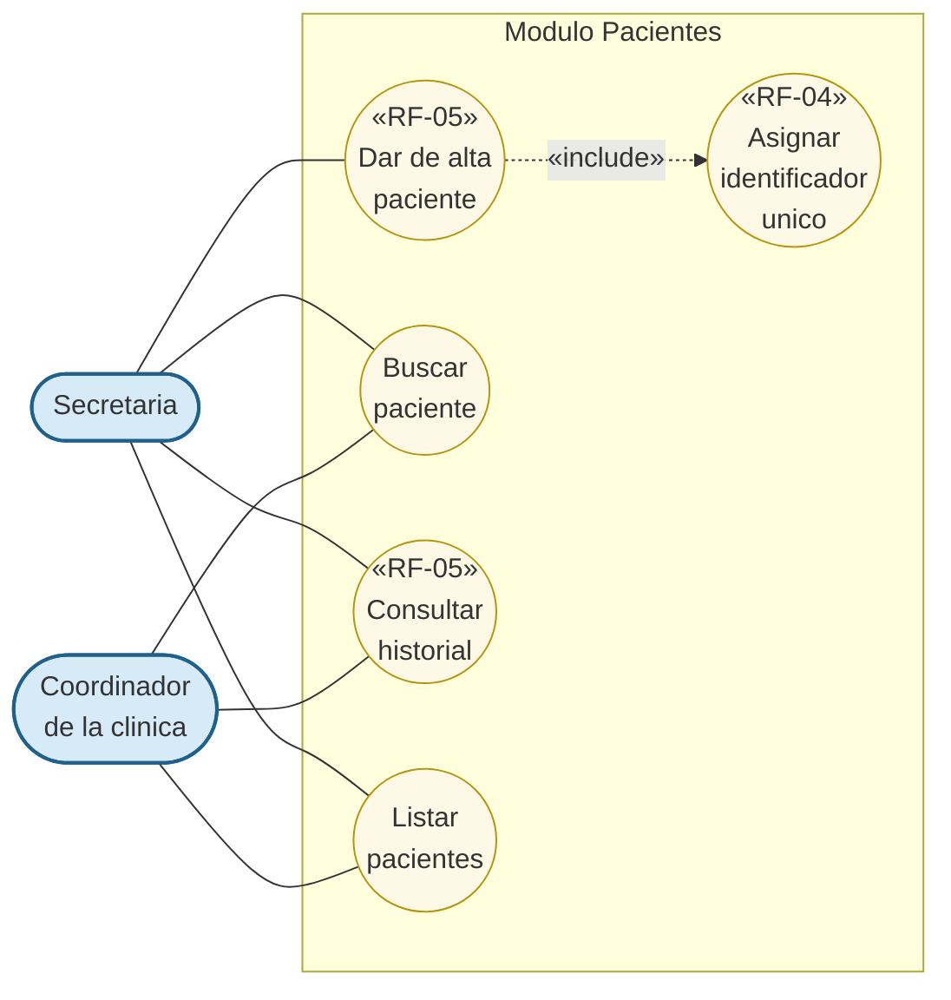

# Modulo Pacientes - Casos de Uso

Casos de uso relacionados con la gestion del expediente del paciente. Cubre los requisitos **RF-04** (generacion de ID unico) y **RF-05** (guardar datos y vincular historial).

## Actores

| Actor | Descripcion |
|---|---|
| **Secretaria** | Crea pacientes, los busca y revisa sus expedientes. |
| **Coordinador de la clinica** | Consulta historial de pacientes para seguimiento. |

## Casos de uso

- **Dar de alta paciente** — Captura datos basicos y genera el expediente. Aplica solo si el paciente no existe aun en el sistema.
  - *Asignar identificador unico* — Genera un folio inequivoco (`PAC-####`) al crear el paciente.
- **Buscar paciente** — Localiza pacientes por nombre completo o por folio.
- **Consultar historial de paciente** — Recupera todas las citas asociadas al expediente, en orden cronologico.
- **Listar pacientes** — Vista paginada o completa del directorio de pacientes.

## Diagrama (Mermaid)

## Reglas

1. **Identidad unica:** el folio se asigna una sola vez. En las citas subsecuentes se reutiliza siempre el mismo.
2. **Nombre normalizado:** se eliminan espacios al inicio y al final antes de guardar.
3. **Trazabilidad:** la creacion de un paciente queda registrada en el audit log automaticamente (via Observer).
4. **Sin duplicados:** el modulo Citas exige seleccionar al paciente desde la lista existente para citas de seguimiento.

## Trazabilidad con requisitos

| Caso de uso | RF | Endpoint backend |
|---|---|---|
| Dar de alta paciente | RF-05 | `POST /api/patients` |
| Asignar identificador unico | RF-04 | (interno en `PatientService.create`) |
| Buscar paciente | (apoyo a RF-01) | `GET /api/patients/search?q=...` |
| Consultar historial | RF-05 | `GET /api/patients/{id}/appointments` |
| Listar pacientes | (apoyo a RF-01) | `GET /api/patients` |
