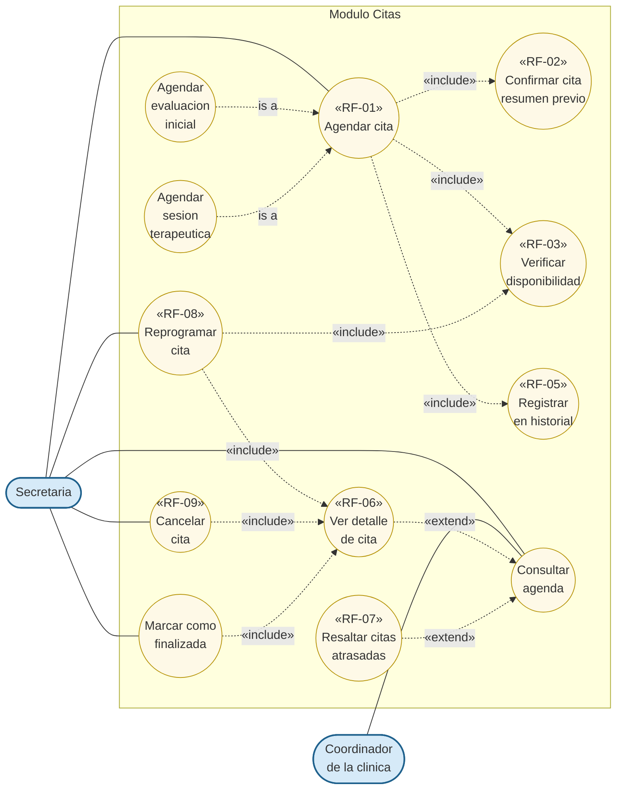

# Modulo Citas - Casos de Uso

Modulo central del sistema. Cubre los requisitos **RF-01** (registro), **RF-02** (resumen previo), **RF-03** (validacion de disponibilidad), **RF-06** (consulta), **RF-07** (alerta visual), **RF-08** (reprogramacion) y **RF-09** (cancelacion).

## Actores

| Actor | Descripcion |
|---|---|
| **Secretaria** | Unico actor con escritura sobre citas: agenda, reprograma, cancela y marca como finalizadas. |
| **Coordinador de la clinica** | Consulta agenda y detalles de citas con fines de supervision. |

## Casos de uso

### Acciones del usuario

- **Agendar cita** — Registrar una nueva cita en la agenda. Se especializa en:
  - *Agendar evaluacion inicial* — Paciente de primera vez. Captura datos y genera folio.
  - *Agendar sesion terapeutica* — Paciente existente. Se selecciona de la lista.
- **Consultar agenda** — Visualizar las citas en formato calendario o listado, con opcion de ver el detalle de cada una.
- **Reprogramar cita** — Modificar fecha u hora preservando el historial.
- **Cancelar cita** — Marcar la cita como cancelada con motivo y liberar el horario.
- **Marcar como finalizada** — Cerrar la cita cuando ya fue atendida.

### Subprocesos invocados

- **Verificar disponibilidad de recursos** — Confirma que terapeuta, sala y paciente esten libres en el rango propuesto y dentro del horario laboral.
- **Confirmar cita (resumen previo)** — Muestra todos los datos para que la secretaria valide antes de persistir.
- **Registrar en historial** — Vincula la cita al expediente del paciente.

### Comportamiento condicional

- **Resaltar citas atrasadas** — Aplica una alerta visual cuando la hora actual supero la hora de inicio y la cita sigue programada. No modifica el estado en base de datos; es solo presentacional.

## Diagrama (Mermaid)

## Reglas

1. **Trazabilidad:** ninguna cita se elimina. Reprogramar conserva la original con estado RESCHEDULED y crea una nueva; cancelar solo cambia el estado.
2. **Validacion obligatoria:** toda creacion o reprogramacion pasa por la cadena: horario laboral → solape de recursos → limite por paciente.
3. **Solape:** terapeuta, sala y paciente no pueden tener dos citas activas en el mismo rango.
4. **Maximo 3 citas activas por paciente.**
5. **Horario laboral:** lunes a viernes, 09:00 a 17:30.
6. **Coherencia terapeuta-sala:** cada terapeuta tiene una sala fija; al agendar se valida la asignacion.

## Trazabilidad con requisitos

| Caso de uso | RF | Endpoint backend |
|---|---|---|
| Agendar cita | RF-01 | `POST /api/appointments` |
| Confirmar resumen previo | RF-02 | (UX en frontend antes del POST) |
| Verificar disponibilidad | RF-03 | `POST /api/appointments/check` |
| Consultar agenda | RF-06 | `GET /api/appointments` |
| Ver detalle de cita | RF-06 | `GET /api/appointments/{id}` |
| Resaltar citas atrasadas | RF-07 | (logica visual en frontend) |
| Reprogramar cita | RF-08 | `POST /api/appointments/{id}/reschedule` |
| Cancelar cita | RF-09 | `POST /api/appointments/{id}/cancel` |
| Marcar como finalizada | (cierre de ciclo) | `POST /api/appointments/{id}/complete` |
