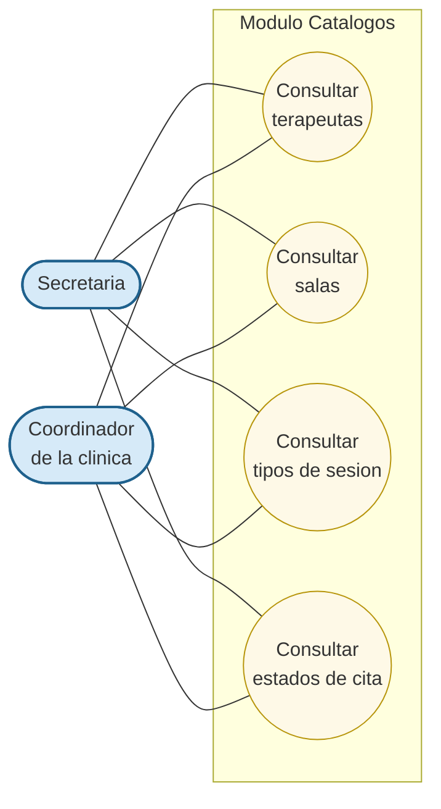

# Modulo Catalogos - Casos de Uso

Casos de uso transversales: proveen los datos de referencia (terapeutas, salas, tipos de sesion, estados) que consumen los demas modulos del sistema. Es de **solo lectura** desde la interfaz administrativa actual.

## Actores

| Actor | Descripcion |
|---|---|
| **Secretaria** | Consulta los catalogos al agendar, reprogramar o filtrar citas. |
| **Coordinador de la clinica** | Consulta los catalogos para supervision. |

> Tambien el propio **Modulo Citas** consume estos catalogos como datos de referencia (no como actor formal, sino como dependencia entre modulos).

## Casos de uso

- **Consultar terapeutas** — Lista los terapeutas activos. Cada terapeuta tiene su sala asignada de forma fija.
- **Consultar salas** — Lista las salas disponibles. La asignacion sala ↔ terapeuta es 1:1.
- **Consultar tipos de sesion** — Devuelve las categorias de sesion (Evaluacion inicial, Sesion terapeutica).
- **Consultar estados de cita** — Devuelve los estados posibles (Programada, Cancelada, Reprogramada, Finalizada).

## Diagrama (Mermaid)

## Reglas

1. **Asignacion fija sala ↔ terapeuta:** cada terapeuta atiende en una sala exclusiva.
2. **Recursos limitados:** 3 terapeutas y 3 salas en total (segun el contexto del sistema).
3. **Inmutabilidad de tipos y estados:** los catalogos de tipos de sesion y estados de cita son sembrados y no se modifican desde la interfaz.
4. **Disponibilidad:** los terapeutas pueden marcarse como inactivos; al agendar solo se ofrecen los activos.

## Trazabilidad con endpoints

| Caso de uso | Endpoint backend |
|---|---|
| Consultar terapeutas | `GET /api/therapists` |
| Consultar salas | `GET /api/rooms` |
| Consultar tipos de sesion | `GET /api/session-types` |
| Consultar estados de cita | `GET /api/appointment-statuses` |
