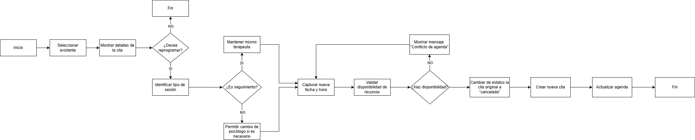
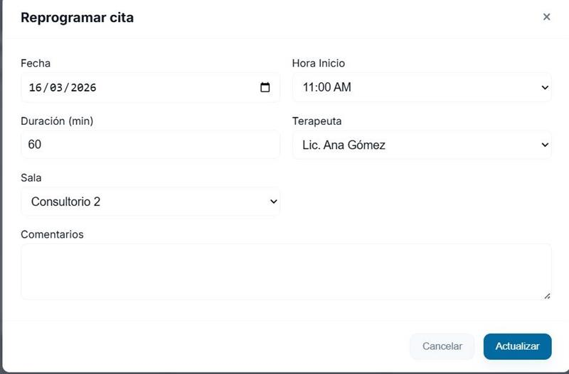

# RF-8 Reprogramar una cita

## Descripcion

El requisito funcional de reprogramar una cita permite al personal administrativo modificar la fecha y hora de una cita previamente registrada sin perder el historial del paciente. Para garantizar la trazabilidad, el sistema no sobrescribe la cita original; en su lugar, cambia su estado a "reprogramada" y genera una nueva cita con los datos actualizados. Durante este proceso, el sistema debe asegurar estrictamente que el nuevo horario cumpla con la regla de negocio de disponibilidad de recursos, terapeuta, sala y horario laboral de 9:00 a 17:30 de lunes a viernes.

## Relacion con otros requisitos

- **RF-6 (Consultar cita)**
Es el paso previo obligatorio, ya que la secretaria necesita seleccionar y ver la cita actual antes de decidir reprogramar.
- **RF-3 (Validar disponibilidad)**
Al elegir la nueva fecha y hora, el sistema debe consumir este RF para asegurar que no haya conflictos de agenda.
- **RF-1 (Crear cita)**
Dado que la regla de negocio dicta que la cita original se archiva y se crea una nueva, el proceso de reprogramacion reutiliza internamente la logica de creacion de citas.

## Lógica de negocio

**La lógica de negocio define las reglas que el sistema debe cumplir.**

1. Selección de cita valida
La cita a reprogramar debe existir en el sistema y encontrarse en un estado que permita modificaciones. No se permite reprogramar citas ya finalizadas o canceladas.

2. No sobrescritura de información
El sistema no debe modificar los datos originales de la cita. En su lugar, debe conservarla.

3. Cambio de estado de la cita original
Al iniciar el proceso de reprogramación, la cita original debe actualizar su estado, indicando que fue sustituida por una nueva.

4. Validación de disponibilidad
Antes de crear la nueva cita, el sistema debe verificar que:

- El terapeuta esté disponible
- La sala asignada esté disponible
- El paciente no tenga otra cita en el mismo horario
- El horario no se traslape con otra cita

5. Atomicidad del proceso

Si ocurre algun error durante la creacion de la nueva cita, no debe modificarse el estado de la cita original.

## Como se veria en el frontend

El personal administrativo selecciona una cita existente, propone un nuevo horario y el sistema valida la disponibilidad antes de confirmar la reprogramacion.

