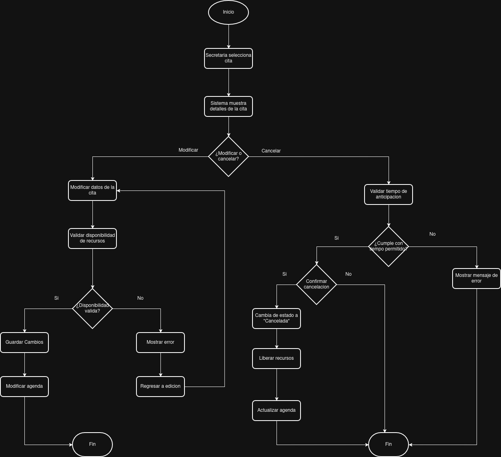
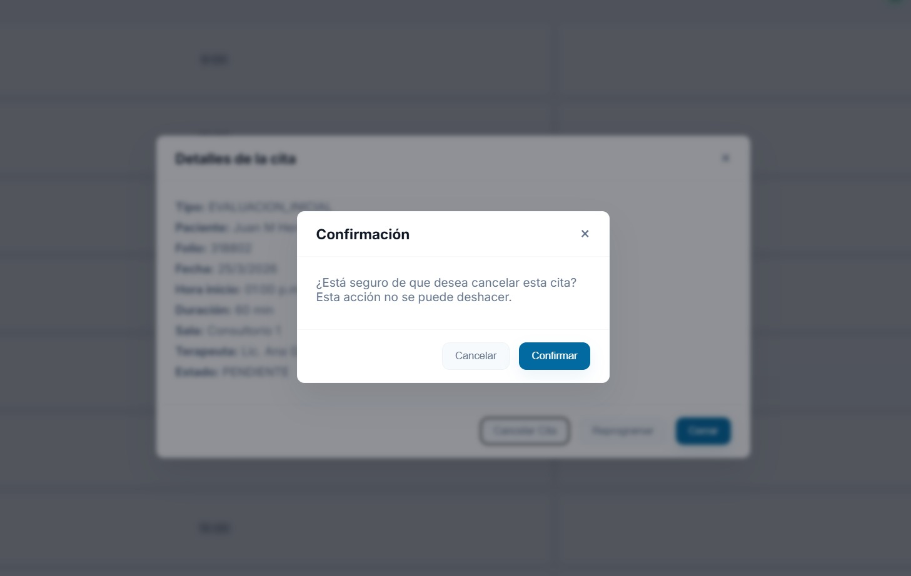

# RF-09 Cancelar Citas con Anticipacion y Actualizar la Agenda

## Descripcion
El sistema debe permitir a la secretaria cancelar una cita previamente registrada antes de su fecha programada. Durante la cancelacion, el sistema debe actualizar automaticamente la agenda para reflejar que ese espacio queda disponible nuevamente.

Ademas, la cancelacion debe quedar registrada para mantener trazabilidad sobre la accion realizada, incluyendo la informacion relevante de la cita y del usuario que realizo la cancelacion.

Una vez cancelada, la cita ya no debe mostrarse como programada dentro de la agenda del sistema.

### Informacion que se registra al cancelar una cita

- cita cancelada (identificador o folio)
- paciente asociado
- fecha de la cita
- hora de la cita
- estado actualizado de la cita (cancelada)
- motivo de cancelacion
- fecha de cancelacion
- usuario responsable de la accion

## Relacion con otros requisitos

- **RF-6 Consultar detalles de una cita:**
  permite visualizar la informacion de la cita antes de cancelarla.

- **RF-8 Reprogramar una cita:**
  si la cita no se cancela, puede ser reprogramada en lugar de eliminarse.

- **RF-3 Validar disponibilidad:**
  al cancelar una cita, se libera el espacio para futuras reservas.

- **RF-7 Identificacion visual de citas atrasadas:**
  una cita cancelada no debe aparecer como atrasada.

## Logica de negocio

### Reglas principales

1. Solo se pueden cancelar citas antes de su hora programada.
2. Al cancelar una cita, su estado debe cambiar a **"cancelada"**.
3. La cita cancelada no debe mostrarse como programada en la agenda.
4. El sistema debe registrar el motivo de la cancelacion.
5. Se debe guardar la fecha y el usuario que realizo la cancelacion.
6. Al cancelarse una cita, el horario debe quedar disponible para nuevas citas.

## Como se veria en el frontend

El usuario selecciona una cita desde la agenda, revisa sus detalles, ingresa el motivo de la cancelacion y confirma la accion.

