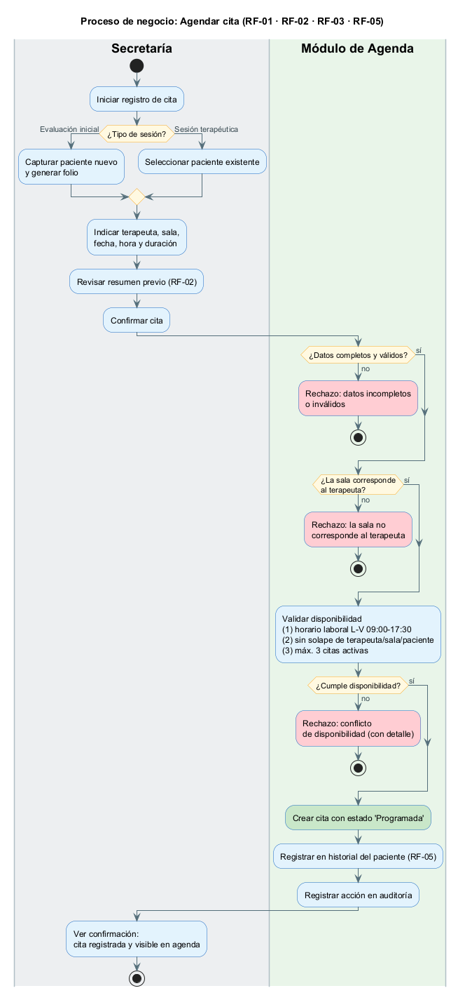
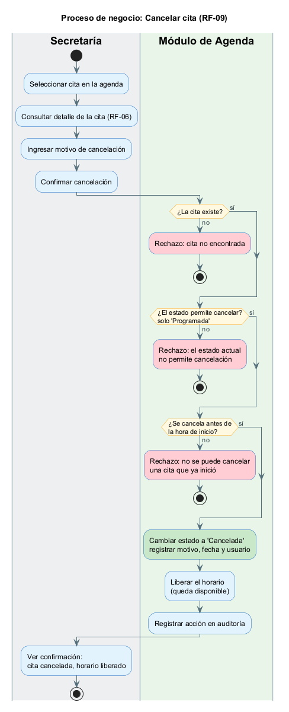

# Diagramas de proceso de negocio (nivel de diseño) — Agendar y Cancelar cita

---

## Explicación del modelo

### ¿Qué representa este diagrama?

Describe **el proceso de negocio**: qué actividades se ejecutan, en qué orden, **quién** es responsable de cada una y qué **decisiones** bifurcan el flujo. No describe *cómo* se programa el sistema, sino *qué pasos sigue el negocio* para lograr un objetivo. Se modelan dos procesos del módulo de agenda: **agendar una cita** y **cancelar una cita**.

### Cómo está organizado (carriles / *swimlanes*)

Cada proceso se divide en **dos carriles** que indican **quién hace cada paso**:

- **Carril Secretaría:** las acciones humanas (capturar datos, revisar el resumen, confirmar, ingresar el motivo).
- **Carril Módulo de Agenda:** las acciones automáticas del sistema (validar datos, comprobar disponibilidad, crear/cancelar la cita, registrar en historial y auditoría).

El flujo cruza de un carril a otro siguiendo el orden temporal del proceso.

### Cómo leer los elementos

| Elemento | Significado | Cómo se lee |
|---|---|---|
| Círculo negro relleno | **Nodo inicial** | Dispara el proceso. |
| Círculo con anillo | **Nodo final** | Cierra ese camino del proceso (éxito o rechazo). |
| Rectángulo redondeado | **Actividad** | Una acción concreta del negocio. |
| Rombo | **Decisión** | El flujo toma **una** salida según la condición (etiquetas "sí"/"no"). |
| Actividad **roja** | **Rechazo** | Un camino de excepción: la operación se detiene. |
| Actividad **verde** | **Resultado clave** | El efecto principal del camino feliz (crear / cancelar la cita). |
| Flecha | **Flujo** | El orden de ejecución. |

### Cómo se modelan los caminos de excepción

Cada validación es una **decisión** (rombo). La salida **"sí"** continúa el camino feliz; la salida **"no"** lleva a una actividad **roja de "Rechazo"** y **termina el intento actual**, informando a la secretaría del motivo. Ante un rechazo, la secretaría **corrige los datos y reintenta** (un nuevo recorrido del proceso). Así el diagrama muestra explícitamente **qué puede salir mal** (cada rama "no" con su motivo) y **qué se hace** (detener e informar para corregir).

---

## Leyenda y reglas

**Reglas de negocio del diseño** (de `system_context.md` y RF): horario **L-V 09:00–17:30**, **máx. 3** citas activas por paciente, **sala fija por terapeuta**, estado inicial **Programada**, las citas **nunca se borran** (cambian de estado), cancelar **solo antes** de la hora de inicio.

**Estados de la cita (diseño):** Programada · Cancelada · Reprogramada · Finalizada. *"Atrasada"* no es un estado: es una condición visual derivada (RF-07).

---

## 1. Proceso de negocio: Agendar cita (RF-01 · RF-02 · RF-03 · RF-05)

> Fuente editable: [`appointment_scheduling_process_bpmn.puml`](appointment_scheduling_process_bpmn.puml)

### Lectura del proceso (Agendar)

1. **Inicio:** la secretaría tiene la necesidad de agendar e **inicia el registro**.
2. Según el **tipo de sesión**, captura un **paciente nuevo** (genera folio) o **selecciona uno existente**.
3. Indica **terapeuta, sala, fecha, hora y duración**, **revisa el resumen previo** (RF-02) y **confirma**.
4. El control pasa al **Módulo de Agenda**, que valida en cadena: **datos completos** → **sala corresponde al terapeuta** → **disponibilidad** (horario laboral, sin solape, máximo 3 citas). Cada decisión con salida **"no"** termina el intento con un **rechazo** (en rojo) que informa el motivo.
5. **Camino feliz:** si todo cumple, el sistema **crea la cita como "Programada"** (en verde), la **registra en el historial** (RF-05) y deja **traza en auditoría**; el proceso termina con la **cita visible en la agenda**.

### Excepciones modeladas (Agendar) — a nivel de regla

| Camino de excepción | Regla de diseño que lo origina |
|---|---|
| Datos incompletos / inválidos | RF-01: información mínima requerida por tipo de sesión |
| Sala no corresponde al terapeuta | Regla "sala fija por terapeuta" (`system_context`) |
| Fuera de horario laboral | RF-03 / RF-01: L-V 09:00–17:30, inicio antes de fin |
| Solape de terapeuta, sala o paciente | RF-03: validación de disponibilidad |
| Paciente con 3 citas activas | RF-01 regla 6: máximo 3 citas pendientes |

---

## 2. Proceso de negocio: Cancelar cita (RF-09)

> Fuente editable: [`appointment_cancellation_process_bpmn.puml`](appointment_cancellation_process_bpmn.puml)

### Lectura del proceso (Cancelar)

1. **Inicio:** la secretaría decide cancelar; **selecciona la cita**, **consulta su detalle** (RF-06), **ingresa el motivo** y **confirma**.
2. El sistema valida en cadena: **¿la cita existe?** → **¿su estado permite cancelar?** (solo "Programada") → **¿se cancela antes de la hora de inicio?**. Cada salida **"no"** termina el intento con un **rechazo** (en rojo).
3. **Camino feliz:** si las tres condiciones se cumplen, el sistema **cambia el estado a "Cancelada"** (en verde) registrando **motivo, fecha y usuario**, **libera el horario** y deja **traza en auditoría**; el proceso termina con el **horario disponible** de nuevo.

### Excepciones modeladas (Cancelar) — a nivel de regla

| Camino de excepción | Regla de diseño que lo origina |
|---|---|
| Cita inexistente | Solo se opera sobre citas registradas (RF-06 regla 4) |
| Estado no cancelable (Cancelada/Finalizada/Reprogramada) | Ciclo de vida de la cita: solo "Programada" admite cancelación |
| Cancelación tardía (ya inició) | RF-09 regla 1: cancelar con anticipación |

---

## 3. Trazabilidad del proceso con el diseño

| Paso del proceso | RF/RNF | Artefacto de diseño |
|---|---|---|
| Elegir tipo de sesión | RF-01 | `SessionType` (diagrama de clases); caso de uso *Agendar* |
| Resumen previo y confirmar | RF-02 | Caso de uso *Confirmar cita (resumen previo)* |
| Validar horario / solape / límite | RF-03, RF-01 | Caso de uso *Verificar disponibilidad*; `Appointment.validateNoOverlap()`, `Patient.canScheduleNewAppointment()` |
| Crear con estado "Programada" | RF-01 | `Appointment.schedule()`; catálogo `AppointmentStatus` |
| Registrar en historial | RF-05 | Relación `Patient → Appointment` (MER) |
| Auditoría de la acción | RNF-04 / trazabilidad | Entidad `AuditLog` (diagrama de clases / MER) |
| Cancelar con motivo y usuario | RF-09 | `Appointment.cancel(motivo, usuario)` |
| Anticipación de cancelación | RF-09 regla 1 | Regla de negocio del requisito |
| Consistencia de la operación | RNF-01 | Requisito no funcional de integridad |
| Caminos de excepción (ramas "no") | RF-01/03/06/09 | `08_evaluacion_diseno/05_diseno_de_excepciones.md` (catálogo de caminos no felices) |
